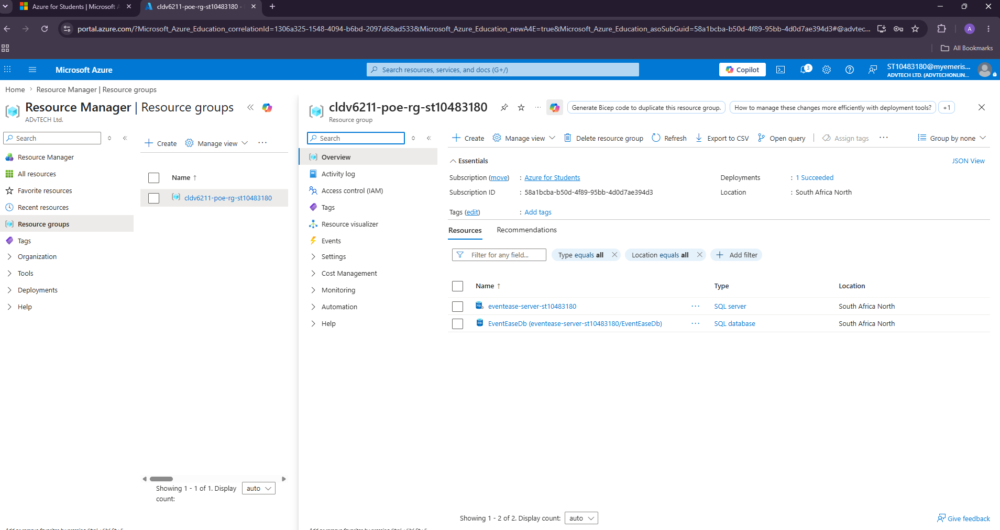
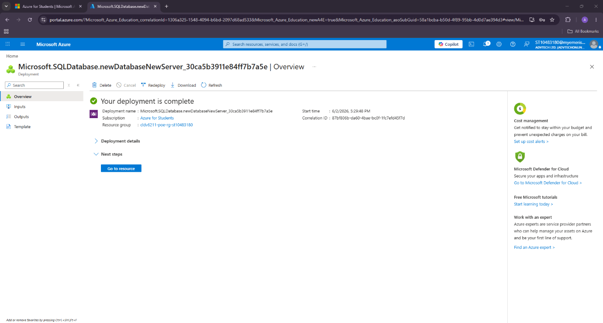
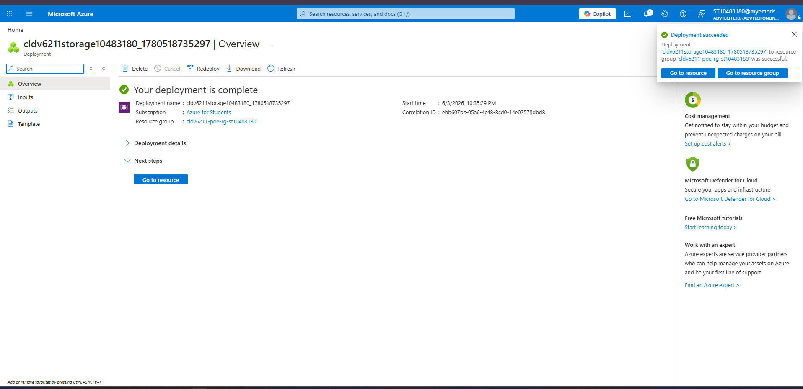
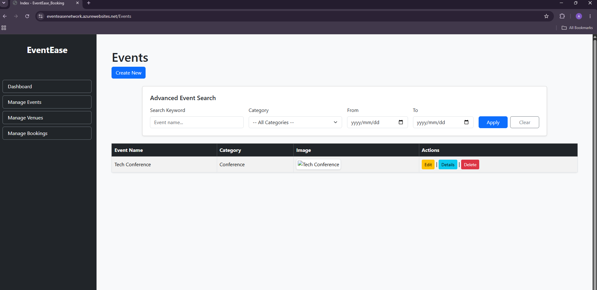
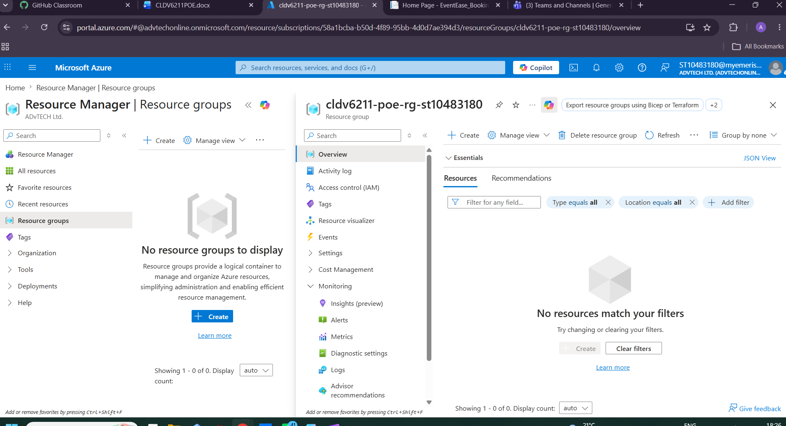

# EventEase-Booking-System

A cloud-integrated event management web application built with ASP.NET Core MVC, integrating Azure SQL Database and Azure Blob Storage for cloud-hosted data and image storage.

📺 **[Watch the demo video](https://youtu.be/slXZJVcJcj4)** — shows the application running live on Azure, including event creation, image uploads, and search/filtering.

> **Note:** The Azure resources for this project (SQL Database, Blob Storage, App Service) have since been decommissioned to avoid ongoing cloud costs. The screenshots and video above document the application while it was live and fully deployed.

## Features

- **Entity CRUD Operations** — full Create, Read, Update, and Delete for Events, Venues, and Bookings, with foreign key constraints enforced to guarantee relational integrity (e.g. a booking can't exist without a valid event reference)
- **Advanced Search & Filtering** — server-side LINQ search with ViewData state persistence, allowing users to filter events by ID or name while keeping the UI simple
- **Cloud Image Hosting** — event and venue images uploaded and served via Azure Blob Storage through a custom `BlobService` class, keeping the main application lightweight
- **Dynamic UI States** — clean handling of edge cases, like a friendly "No events found" message when a search returns no results
- **Error Handling & Resiliency** — configured SQL connection resiliency to keep the app stable during cloud latency or transient database errors

## Tech Stack

- **Language:** C#
- **Framework:** ASP.NET Core MVC
- **Database:** Azure SQL Database (via Entity Framework Core)
- **File Storage:** Azure Blob Storage
- **Frontend:** HTML5, CSS, Razor Views (`.cshtml`), Bootstrap
- **Version Control:** Git, GitHub

## Cloud Architecture

| Component | Purpose |
|---|---|
| **Azure SQL Database** | Fully managed relational database providing scalability, high availability, and automated backups |
| **Azure Blob Storage** | Hosts event/venue images, keeping the web app stateless so it can scale horizontally without local file dependencies |
| **Azure App Service** | Hosts the MVC application as a PaaS offering, handling OS/runtime management so development stays focused on application code |

## Screenshots

**Azure Resource Group**

**SQL Server Deployment**

**Blob Storage Deployment**

**Application Running**

**Resources After Cleanup**

## The Migration: Local to Cloud

Moving from local emulators (LocalDB, Azurite) to live Azure services surfaced a few real-world challenges:

- **Schema-mapping issue:** the app initially threw a `NullReferenceException` on the Event creation screen. The root cause was environment mismatch — the connection string was pointing at a blank Azure SQL instance instead of the one with seeded data, because the local `appsettings.json` values were being ignored in production. The fix was configuring the correct connection string directly in Azure App Service's Application Settings, reinforcing the importance of environment parity between local and production config.
- **Environment separation:** keeping local and production environments distinct allowed safe "sandbox testing" — a runtime issue in the category-edit feature was isolated and fixed locally before ever reaching the live Azure deployment, avoiding configuration drift into production.

## How to Run Locally

1. Clone the repository, or download it via the green **Code** button
2. Open the project in Visual Studio
3. Configure your own Azure SQL connection string and Blob Storage credentials in `appsettings.json` (placeholders are provided — replace with your own Azure resource values)
4. Run Entity Framework migrations: `dotnet ef database update`
5. Run the application

## Future Improvements

- Move Blob Storage image handling to include automated thumbnail generation
- Expand automated testing coverage (unit tests for controllers and services)
- Add CI/CD via GitHub Actions for automated build verification on push
